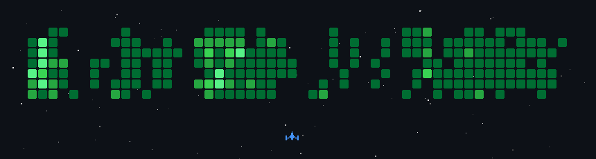
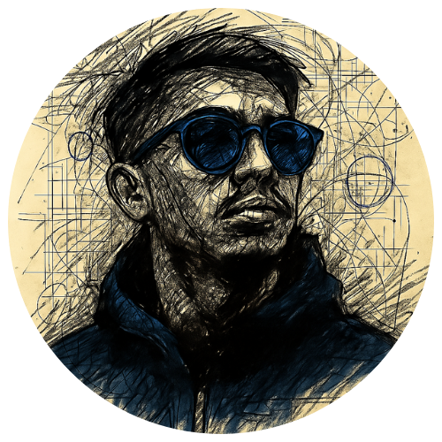

<h4><b>Hi there! Go checkout Zab's profile, SLOWLYYY.</b></h4>

<h3><b>BSIT Student</b> at <b>National University - Manila</b></h3>
<h3><b>Software Engineer Intern</b> @ <b>MEC Networks Corp.</b></h3>
<h4><i>Aspiring Full Stack Developer</i></h4>

---

<table>
  <tr>
    <th>Mobile App Development</th>
    <th>Web Development.</th>
    <th>Backend & Databases</th>
    <th>Other Tools</th>
  </tr>
  <tr>
    <td align="center">
      
      
      
    </td>
    <td align="center">
      
      
    </td>
    <td align="center">
      
      
      
      
      
      
    </td>
    <td align="center">
      
      
      
      
    </td>
  </tr>
</table>

---

##  GitHub Statistics

<!-- GitHub Stats -->
<picture style="display: inline-block;">
<source media="(prefers-color-scheme: dark)" srcset="https://github-readme-stats-topaz-tau-50.vercel.app/api?username=zabjt&show_icons=true&bg_color=0d1117&title_color=F33A6A&icon_color=00F3FF&text_color=ffffff&border_color=F33A6A&hide_border=false&count_private=true&include_all_commits=true&border_radius=10&hide=stars,issues" />

</picture>
<!-- Streak Stats -->
<picture>
<source media="(prefers-color-scheme: dark)" srcset="https://streak-stats.vercel.app/?user=zabjt&background=0d1117&border=F33A6A&stroke=F33A6A&ring=F33A6A&fire=F33A6A&currStreakLabel=00F3FF&sideNums=00F3FF&sideLabels=00F3FF&currStreakNum=F33A6A&dates=ffffff" />

</picture>
<!-- Top Languages -->
<picture style="display: inline-block;">
<source media="(prefers-color-scheme: dark)" srcset="https://github-readme-stats-topaz-tau-50.vercel.app/api/top-langs/?username=zabjt&bg_color=0d1117&title_color=F33A6A&text_color=ffffff&border_color=F33A6A&hide_border=false&layout=compact&count_private=true&include_all_commits=true&border_radius=10" />

</picture>

 
 

<!-- GitHub Trophies -->
<picture>

</picture>

---
 

 

###  Connect With Me

---

*Thanks for visiting my profile. Feel free to explore my repositories!* 

